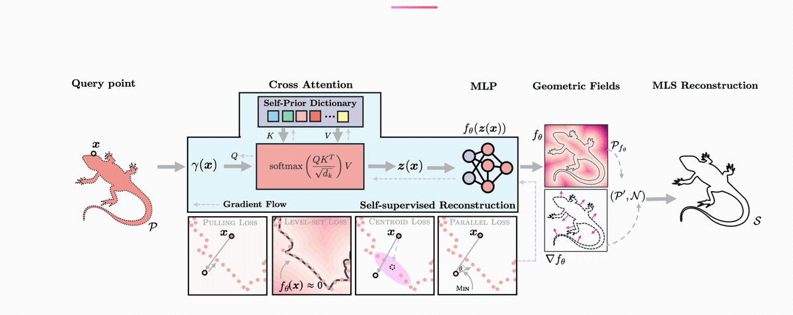

# Self-Supervised Implicit Attention Priors for Point Cloud Reconstruction

**[Project Page](https://attnprior.netlify.app/) | [Paper (arXiv 2511.04864)](https://arxiv.org/abs/2511.04864)**

> Kyle Fogarty, Chenyue Cai, Jing Yang, Zhilin Guo, Cengiz Oztireli
> University of Cambridge · Princeton University · 3DV 2025



We address the ill-posed problem of recovering high-quality surfaces from irregular point clouds by introducing an *implicit self-prior* that distills a shape-specific prior directly from the input. A small dictionary of learnable embeddings is jointly trained with a neural distance field; at every query location, the field attends to the dictionary via cross-attention, capturing repeating structures and long-range correlations in the shape. The trained field provides analytic normals via autodiff, which are passed to RIMLS to produce the final mesh — no external training data required.

## Installation

```bash
conda env create -f environment.yml
conda activate attn-prior
```

> **pytorch3d:** pre-built wheels are architecture-specific. If the install fails, see the [official guide](https://github.com/facebookresearch/pytorch3d/blob/main/INSTALL.md).
> **faiss:** the environment uses `faiss-gpu`. Replace with `faiss-cpu` if needed.

## Training

```bash
python train.py --input inputs/virus_pca_normals_holes.xyz --output_dir output/
```

Checkpoints, estimated normals, and the final surface mesh are written to `output/`. Run `python train.py --help` for all options.

## Citation

```bibtex
@inproceedings{fogarty2025attnprior,
  title     = {Self-Supervised Implicit Attention Priors for Point Cloud Reconstruction},
  author    = {Fogarty, Kyle and Cai, Chenyue and Yang, Jing and Guo, Zhilin and Oztireli, Cengiz},
  booktitle = {International Conference on 3D Vision (3DV)},
  year      = {2025}
}
```
